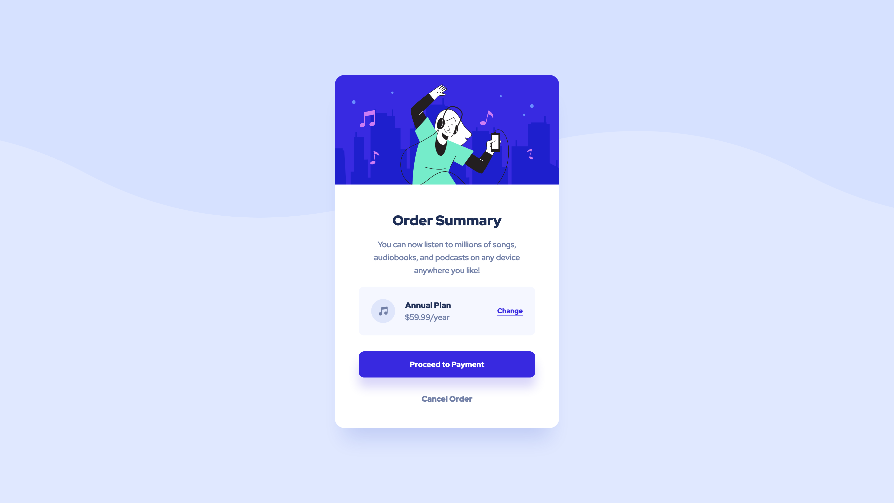

# Frontend Mentor - Order summary card solution

This is a solution to the [Order summary card challenge on Frontend Mentor](https://www.frontendmentor.io/challenges/order-summary-component-QlPmajDUj). Frontend Mentor challenges help you improve your coding skills by building realistic projects. 

## Table of contents

- [Overview](#overview)
  - [The challenge](#the-challenge)
  - [Screenshot](#screenshot)
  - [Links](#links)
- [My process](#my-process)
  - [Built with](#built-with)
  - [What I learned](#what-i-learned)
  - [Continued development](#continued-development)
  - [Useful resources](#useful-resources)
- [Author](#author)
- [Acknowledgments](#acknowledgments)

## Overview

### The challenge

Users should be able to:

- See hover states for interactive elements

### Screenshot

### Links

[solution URL](https://github.com/Cinquantesix/order-summary-component-main)
[live site URL](https://polite-eclair-5fdd16.netlify.app/)

## My process

What I want to try in this challenge before to begin with junior stuff:

- Make a better HTML (less div, more relevant tag)
- Use BEM or anything apparent
- Try use less grid and more flexbox and be able to make the good choice between these two sibling
- Use more variable in SCSS

### Built with

- Semantic HTML5 markup
- CSS custom properties
- Flexbox
- CSS Grid
- SCSS

### What I learned

I learn a lot between Grid en Flexbox but also how to use firefox inspector. It really help to see and understand these two. I also try a new way to add mediaqueries in my SCSS which I don't think it will be the better way to add in a big project. But anyway, I learn it so maybe it will help someday!

### Continued development

Now I wan't to step up and try the Junior challenge with more JS and Maybe add SCSS mixin. I also want' to developp with more tools like CMS and why note REACT or anything else.

### Useful resources

- [Flexbox Guide](https://css-tricks.com/snippets/css/a-guide-to-flexbox/)
- [Grid Guide](https://css-tricks.com/snippets/css/complete-guide-grid/)

## Author

- Frontend Mentor - [@Cinquantesix](https://www.frontendmentor.io/profile/Cinquantesix)
- Codepen - [@cinquantesix](https://codepen.io/cinquantesix)

## Acknowledgments

Thanks [@gmagnenat](https://www.frontendmentor.io/profile/gmagnenat) for his help and good advice.
Thanks [@elaineleung](https://www.frontendmentor.io/profile/elaineleung) for the flexbox and max-width tips in previous challenge.
